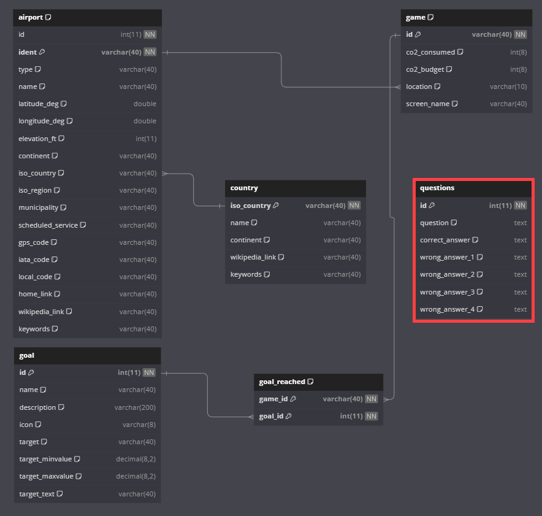

---
LENTOPELIPROJEKTI - METROPOLIAN TIETO- JA VIESTINTÄTEKNIIKAN OHJELMISTO 1-KURSSI

Tämä on Metropolian Tieto- ja Viestintätekniikan Ohjelmisto 1-kurssin lentopeliprojektin repository, joka on toteutettu kurssin loppuprojektina. 
Projektin tarkoituksena oli kehittää yksinkertainen lentopeli, jossa käytetään python ohjelmointikieltä sekä yhdistetään tietokantoja.

---
TOIMINTA OHJEET PELIN AJAMISEEN (ns. tyhjältä pöydältä)

1. Mariadb MSI-paketin lataaminen https://mariadb.org/download/
  - Aja asennusohjelma oletuksilla.
  - Käytä kohdissa 'Käyttäjä' ja 'Salasana' molemmissa tekstiä 'root'. Sekä aseta kohtaan 'Portti' luku: 3306.

Alustavasti tarvitaan flight_game tietokanta, jonka luontiskripti löytyy Metropolian Moodlesta. Luontiskripti on lisätty myös tämän repositoryn kansioon "Database", jossa (flight_game_luontiskripti.sql). Tarvitset sitä kohdassa (2.)

2. Lentopelin tietokannan luominen MariaDB:ssä
  - Step1: Luo tietokanta (create database flight_game)
  - Step2: Siirry MariaDB:ssä äsken luomaasi tietokantaan (use flight_game)
  - Step3: Aja (flight_game_luontiskripti.sql) MySQL Command Line Clientissä seuraavalla komennolla:
    - source full\path\tosql\flight_game_luontiskripti.sql   <- muokkaa reitti, siten minne sen olet ladannut.

4. Lataa libraryt; colorama ja art - (esim. IDE:n terminaalissa aja komennot: pip install colorama, pip install art , tai "käsin" lataa IDE:n osioista expansions/extensions)

5. Aja KYSYMYSTAULUNLUONTI.py tiedosto vain KERRAN, jotta saadaan tarvittava (questions) taulu valmiiseen flight_game tietokantaan.

6. 
---
Muokattu relaatiotietokanta.
